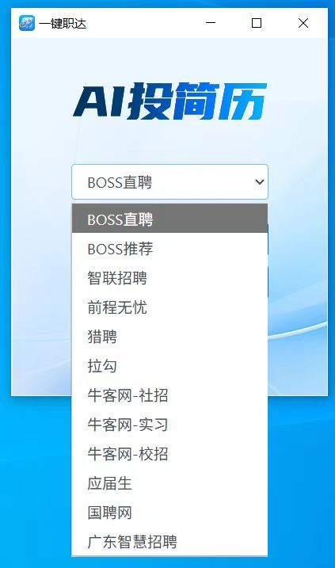
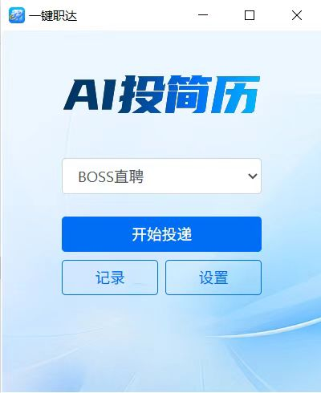
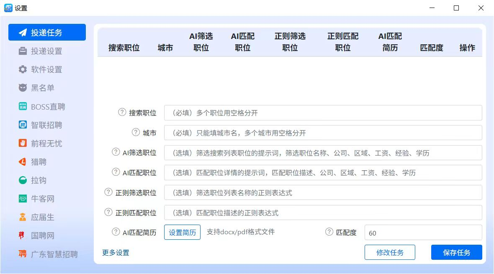
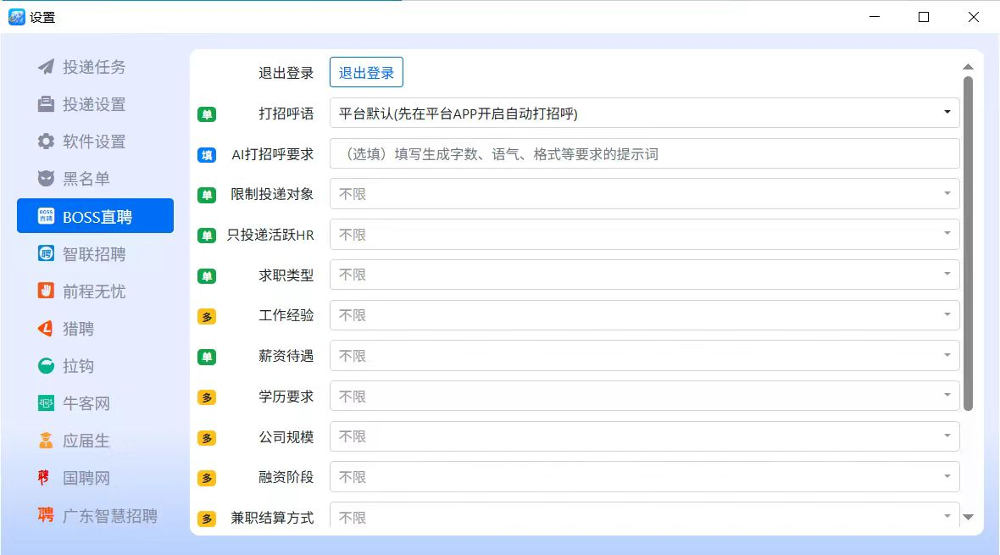

# 一键职达 - AI批量全自动投简历软件

- 

## 简介

最强大的AI全自动投简历软件，支持平台最多，功能最完善！支持 Windows 和 MacOS。无需复杂操作，只需点点鼠标上传简历，设置投递职位和城市，自动完成简历投递流程，轻松投递成百上千份简历，让HR来找你！。

## 功能特点

- **AI筛选职位**
- **AI匹配职位**
- **AI匹配简历**
- **正则筛选职位**
- **正则匹配职位**
- **AI打招呼**
- **支持指纹浏览器**
- **多任务投递**
- **自动登录**
- **黑名单**
- **投递记录**
- **投递提醒**
- **定时投递**
- **支持9个招聘平台**  
  BOSS直聘、智联招聘、拉钩、猎聘、前程无忧、国聘网、牛客网、应届生、广东智慧招聘
- **更多功能持续更新中**

## 使用步骤

1. **下载软件**  
   下载地址：[http://yjzd.work](http://yjzd.work/)。

2. **设置浏览器和投递职位**  

3. **一键开始投递**  

## 下载地址

[官网下载链接](http://yjzd.work/)

- 
- 
- 

---

祝您找到理想的工作！
